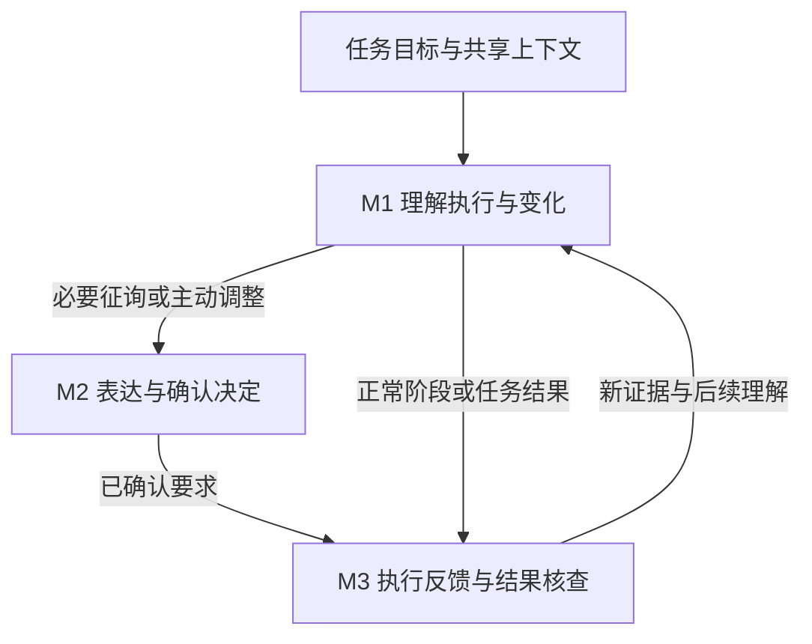

# 人与智能体交互研究框架

> **研究起点补充：** 从用户逐步操作转向目标委托后，Agent持续产生多类过程输出。本文研究如何组织这些输出、支持用户理解并参与；长时空间任务是应用与验证背景，状态证据与数据关联服务于这一主线。

> **2026-09-14 题目与主体确认：** 采用《面向长时空间任务的人—智能体交互机制设计与实现》。研究主体为人与 Agent；多智能体内部协同为支撑能力。保留 M1—M3 及自主接替、新增区域两个重点案例。

2026-09-14 交互主线确认版，对齐[研究问题](research-question.md)。以下为设计计划，不代表已实现或有效。

## 总体关系

用户表达目标与约束，Agent解释要求并推进任务，持续输出计划、工具结果、进度、变化和征询等信息；界面组织这些输出，支持理解、参与及结果确认。设备群自主执行和接替是应用背景。

正常监督可以持续处于M1；必要征询和用户主动调整均可进入M2；阶段及最终结果进入M3。不强制每次自动变化要求批准。安全暂停可作为业务允许的调整方式，不以不停机编辑为前提。

## 三项机制怎样衔接

M1让用户看懂Agent正在做什么，M2让用户在需要时作出决定或修改要求，M3让用户知道决定之后发生了什么、结果是否符合要求。三者围绕同一任务和空间对象衔接，不要求每条输出都触发人工操作。

数据标识、任务与Run的关系、连续修改和迟到反馈处理属于实现章；它们保证交互正确，不替代交互研究问题。

## 三项机制

| 机制 | 用户问题 | 输入与输出 | 拟设计的交互 |
| --- | --- | --- | --- |
| M1 执行信息组织与呈现 | 现在怎样、发生了什么、与任务有什么关系？ | 目标解释/计划/工具结果/进度/变化 → 可理解的任务过程 | 按任务组织多类输出，突出重点与待处理事项，摘要/详情分层，地图与任务相互定位 |
| M2 用户与Agent的协同介入 | 我要改什么、影响什么、如何准确表达？ | 新要求或征询＋当前上下文 → 调整要求与确认记录 | 地图选区/对象选择、约束输入、影响预览、修订/取消/确认 |
| M3 执行衔接与反馈 | 调整是否落实、任务是否达到要求？ | 已确认要求＋执行依据 → 结果判断上下文 | 按任务/对象查看落实，区分接受与执行结果，保留未完成项及处理入口 |

具体控件在需求核查后选择；已有地图联动、时间线及反馈可借鉴，不逐项宣称原创。

## 变化说明与状态证据

变化沿用“发生什么—为什么—影响什么—还有什么未知”的结构。M1 解释已发生变化，M2 对候选调整给出同一结构的预览，M3 将有依据的落实情况更新回 M1。

区分已确认事实、最后报告、当前未知与后续计划，标明对象、来源、依据时间和适用范围；最后报告可能包含历史事实，不能直接代表当前状态。具体规范、理论比较与评价对应见[大纲](outline.md)和[设计追溯表](design-traceability.md)。这些是 M1—M3 的细化，不增加独立机制或预设创新。

## 长时间与空间如何进入设计

- 时间：持续演化、相关历史、当前执行与后续安排、多次介入的上下文衔接；不默认全量动画回放。
- 空间：设备、区域、路径既是查看对象也是操作对象；选择、修改范围及影响对象应与任务语义对应，不默认三维或VR。
- 关联：查看任务变化能找到对应空间对象，选择区域能定位相关任务与必要过程信息。历史、预览和反馈是否进一步联动由需求决定。

## 空间交互优先探索

优先探索空间交互：围绕任务、设备、区域与路径，研究用户如何理解变化、表达调整和核查结果。空间对象与任务过程的联动、空间操作与语言表达的衔接是候选设计入口，尚未选定具体创新。交互机制和支撑交互的技术实现均可形成贡献，但需说明相对已有方案的差异及证据；不能由“单位尚未实现”或“感觉研究较少”推断新颖性。

设计时检验空间操作是否帮助用户完成具体任务，而非仅增加地图元素。例如：选中区域后如何表达任务要求，查看变化时如何关联先前安排与当前对象，如何在同一空间上下文核查调整结果。以上是探索问题，不是已证实需求或必须全部实现的功能。

技术探索围绕这些操作的上下文传递、状态同步、响应与恢复展开；具体方法随原型确定，仍不转向接替算法或推荐研究。

## 场景层次

系统应用为长时空间任务监督。协作情境包括S1目标委托、S2过程监督、S3必要征询、S4主动调整、S5异常恢复、S6结果确认。案例用于演示和评价，不替代全文。

| 案例 | 用户交互重点 | 不预设的业务事实 |
| --- | --- | --- |
| 正常执行 | 理解进度、空间分布与后续安排，确认阶段结果 | 不假定必须持续盯屏或离席 |
| 新增区域 | 表达区域与要求，理解原安排变化，确认结果 | 不假定每次人工选设备或审批 |
| 异常及自主接替 | 理解变化、判断是否符合要求，必要时否决/改派 | 不假定接替必然错误，失联等于停止 |

已知/未知是必要的信息边界，不再将不确定性包络或推荐解释指定为全文必选机制。

## 共同规则与实现边界

任务、对象、调整和反馈保持稳定标识；历史视图标明时间；预测与事实区分；下发、接受、执行与完成按可获得依据区分。过去动作不能通过编辑历史撤销。迟到反馈归属对应调整，不能覆盖新要求。

前端规则负责确定性显示和操作；共享上下文提供当前选区及任务；受控工具用于确需前端完成的交互，不必新增前端Agent。缺失接口可用标明边界的脚本模拟，不虚构实时数据。

情境感知支持信息需求分析，行动模型支持表达与结果判断分析，混合主动交互支持职责分析；时间/空间交互文献提供比较方案，不唯一推出界面。

优先评价完整系统EQ1/EQ2；资源允许时选一项特色设计深化。逐项对应见[设计追溯表](design-traceability.md)，验证见[研究方法](methodology.md)。
